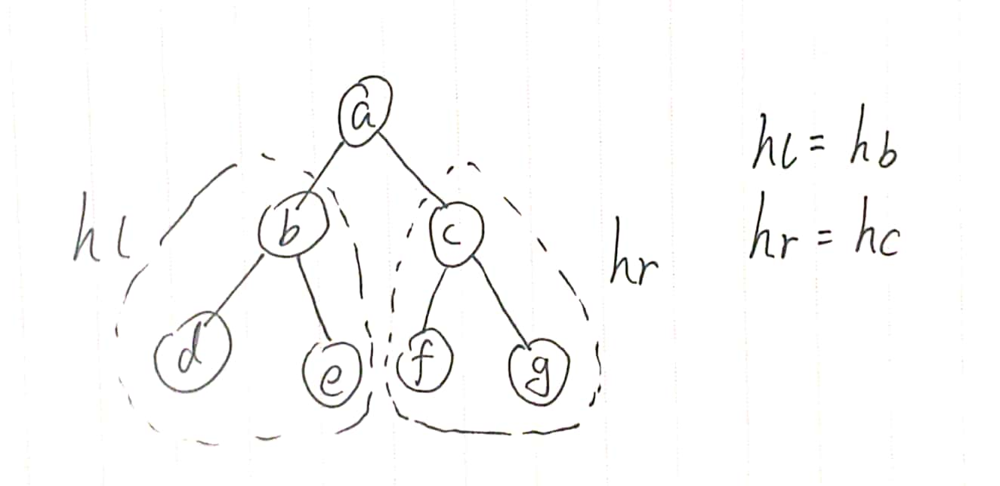
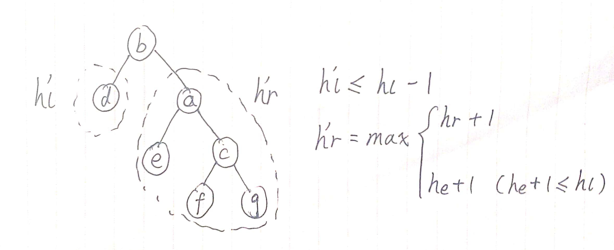
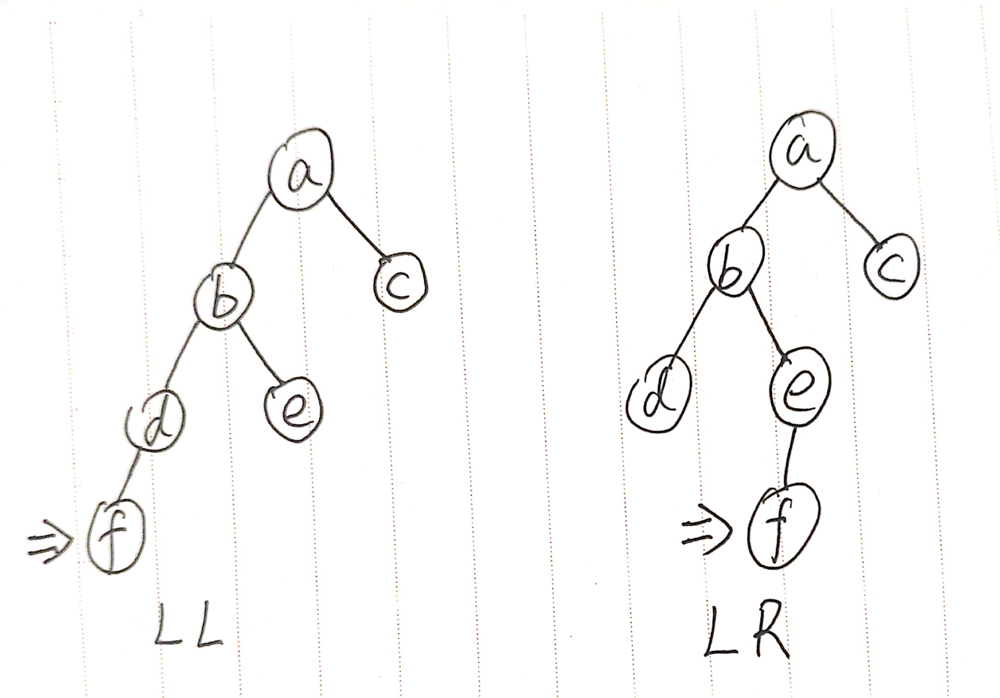
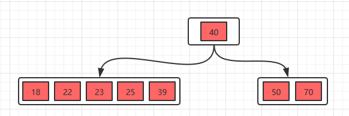
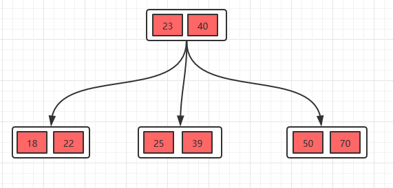
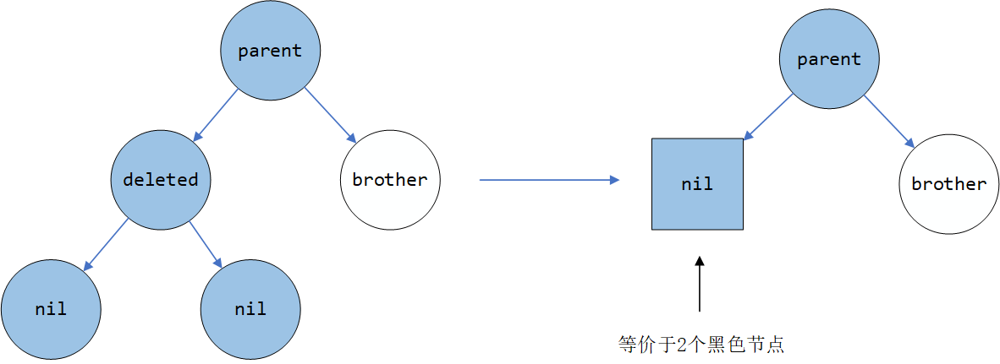
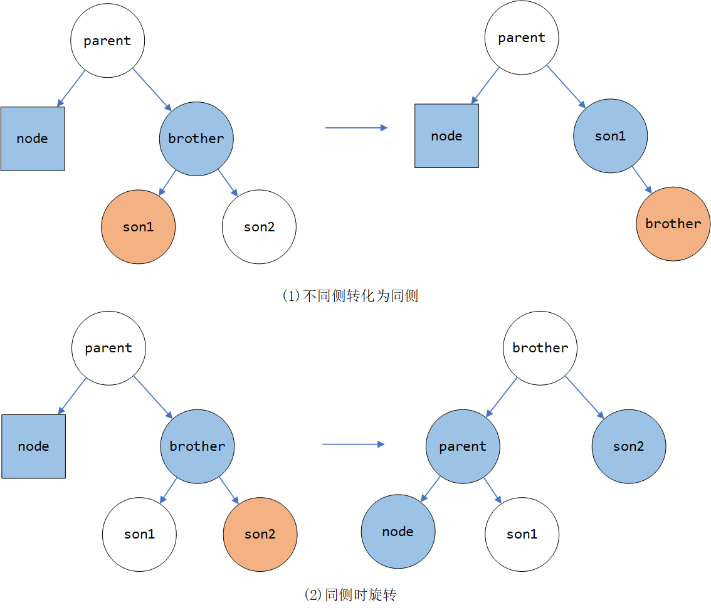
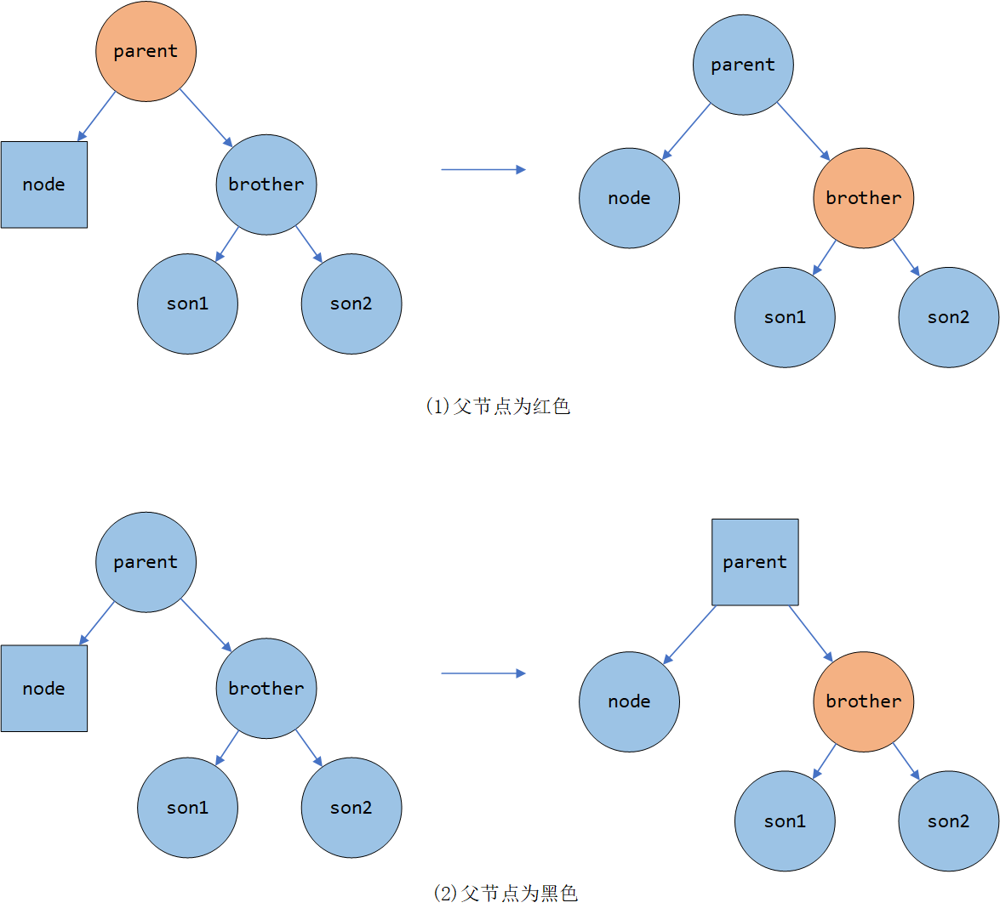
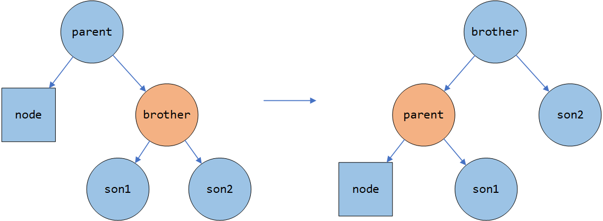

## 前置定义

-   满(full)二叉树：

    -   英文wiki：每个节点都有0或2个子节点
    -   国内教材：除最低层的节点外，每个节点都有2个子节点（即第$i$层的节点数为$2^i-1$）

-   完美(perfect)二叉树：（国内版）满二叉树

-   完全二叉树：除最底层外，每一层都被填满；最底层的节点尽可能靠左。

    >   In a **complete** binary tree every level, *except possibly the last*, is completely filled, and all nodes in the last level are as far left as possible


## AVL树

定义：

-   AVL树：高度平衡的二叉搜索树（任意节点的两个子树的高度差$\le$ 1）

-   平衡因子：某个节点的右子树高度-左子树高度

    因此，AVL树又可作如下定义：任意节点平衡因子的绝对值小于等于1的二叉搜索树


当插入或删除节点导致不平衡时，AVL通过旋转节点来重新平衡节点。


### 旋转时发生了什么

 

如图，设根节点的左子节点高度为$h_l$，右子节点高度为$h_r$，下面以右旋为例



右旋以后，左子节点的高度为$h'_l$，右子节点高度为$h'_r$，观察可知
$$
\begin{aligned}h'_l&\le h_l - 1\\ h'_r&\le max(h_r+1,h_l)\end{aligned}
$$
显然右旋时，需要根据$h_e$来进行分类讨论。


### 插入/删除操作

同样以右旋为例



### LL型

假设插入$f$后使得当前子树$a$失衡，且$h_b=h_d+1$

由于插入前是AVL树，因此$h_e\le h_c$

对$b$进行一次右旋，新的树有$h'_l=h_l-1,h'_r=max(h_e,h_c)+1=h_c+1$

删除操作同理


#### LR型

假设插入$f$后使得当前子树$a$失衡，且$h_b=h_e+1$

如果直接右旋，会导致$h'_r=h_e+1>h_r$

因此要先对$e$进行一次左旋，再对$e$进行右旋

删除操作同理


### Java实现及测试代码

实现了**插入**、**删除**操作

关键字不可重复

<el-collapse>
<el-collapse-item title="AVL树代码（展开）" name="1">

```java
package DataStructure.Tree;

import com.sun.istack.internal.Nullable;

import java.util.ArrayList;
import java.util.List;

public class AVLTree<T extends Comparable<T>> implements Tree<T>{

    private AVLNode<T> root;

    @Override
    public void insert(T value) {
        root = insert(value, root, null);
    }

    @Override
    public void remove(T value) {
        root = remove(value, root);
    }

    @Override
    public List<T> travel() {
        ArrayList<T> result = new ArrayList<>();
        travel(result, root);
        return result;
    }

    private AVLNode<T> insert(T value, AVLNode<T> node, AVLNode<T> parent){
        if(node == null) return new AVLNode<>(value, null, null, parent);
        if(node.value.compareTo(value) == 0) return node;

        int dir = node.value.compareTo(value) > 0 ? 0: 1;
        node.children[dir] = insert(value, node.children[dir], node);
        node.updateHeight();
        return rebalance(node);
    }

    private AVLNode<T> remove(T value, AVLNode<T> node){
        if(node == null) return null;
        if(node.value.compareTo(value) == 0){
            // 没有子节点
            if(node.children[0] == null && node.children[1] == null) return null;

            // 只有一个子节点
            if(node.children[0] == null || node.children[1] == null){
                int notNullIdx = node.children[0] == null ? 1 : 0; // 子节点方向
                node.children[notNullIdx].parent = node.parent;
                return node.children[notNullIdx];
            }

            // 有两个子节点，先按常规BST的方法删除
            AVLNode<T> least = node.children[1];
            while(least.children[0] != null) least = least.children[0];
            node.value = least.value;
            least.parent.children[getDirection(least)] = least.children[1];
            if(least.children[1] != null) least.children[1].parent = least.parent;
            least.parent.updateHeight();
            // 从least节点开始，一直向上rebalance
            AVLNode<T> current = least.parent;
            while(current != node){
                current.updateHeight();
                current = rebalance(current).parent;
            }
            return rebalance(node);

        } else {
            int dir = node.value.compareTo(value) > 0 ? 0 : 1;
            node.children[dir] = remove(value, node.children[dir]);
            node.updateHeight();
            return rebalance(node);
        }
    }

    /**
     * 对节点进行再平衡
     */
    private AVLNode<T> rebalance(AVLNode<T> node){
        // dir: 重子树（高度更高的子树）的位置
        int dir = height(node.children[0]) > height(node.children[1]) ? 0 : 1;
        int heavy = height(node.children[dir]);
        int light = height(node.children[dir ^ 1]);
        if(Math.abs(heavy - light) >= 2){
            if(height(node.children[dir].children[dir]) > height(node.children[dir].children[dir ^ 1])){
                return rotate(node.children[dir]); // LL 或 RR
            }else{ // LR 或 RL
                AVLNode<T> n = node.children[dir].children[dir ^ 1];
                return rotate(rotate(n));
            }
        }
        return node;
    }

    /**
     * 将节点左旋（或右旋）
     */
    private AVLNode<T> rotate(AVLNode<T> node){
        if(node == root) throw new IllegalStateException("不能旋转根节点");

        AVLNode<T> parent = node.parent;
        AVLNode<T> grandParent = parent == null ? null : parent.parent;
        int direction = getDirection(node);

        node.parent = grandParent;
        if(grandParent != null) grandParent.children[getDirection(parent)] = node;
        parent.children[direction] = node.children[direction ^ 1];
        if(node.children[direction ^ 1] != null) parent.children[direction].parent = parent;
        node.children[direction ^ 1] = parent;
        parent.parent = node;

        parent.updateHeight();
        node.updateHeight();

        if(node.parent == null) root = node;
        return node;
    }

    /**
     * 获取当前节点对于父节点的方向
     * @return 如果当前节点为父节点的左子节点，则返回0，否则返回1
     */
    private int getDirection(AVLNode<T> node){
        if(node.parent == null) throw new IllegalStateException("不能对根节点调用getDir");
        return node.parent.children[0] == node ? 0 : 1;
    }

    /**
     * 中序遍历二叉树
     */
    private void travel(List<T> result, AVLNode<T> node){
        if(node != null){
            travel(result, node.children[0]);
            result.add(node.value);
            travel(result, node.children[1]);
        }
    }

    public static int height(AVLNode<?> node){
        return node == null ? 0 : node.height;
    }

    private static class AVLNode<T> {
        private int height = 1;
        private AVLNode<T>  parent;
        private AVLNode<T>[] children = new AVLNode[2];
        private T value;

        private AVLNode(T v, @Nullable AVLNode<T> left, @Nullable AVLNode<T> right, @Nullable AVLNode<T> parent){
            value = v;
            children[0] = left;
            children[1] = right;
            this.parent = parent;
            updateHeight();
        }

        private void updateHeight(){
            height = Math.max(height(children[0]), height(children[1])) + 1;
        }
    }

}
```

</el-collapse-item>

<el-collapse-item title="测试代码（展开）" name="2">

测试代码

输出：`time: 20.106 s`

```java
package Tree;

import Tree.AVLTree.AVLTree;

import java.util.*;

public class Main {

    private static final int TEST_LENGTH = 1000000;

    public static void main(String[] args) {

        for(int i=0; i<10; i++){
            if(!judge(Util.generateRandomNumber(TEST_LENGTH, 1, 10000000)))
                System.out.println("err on " + i);
        }

        long begin = System.currentTimeMillis();
        for(int i=0; i<10; i++){
            speedTest(Util.generateSortedNumber(TEST_LENGTH, 1));
            speedTest(Util.generateRandomNumber(TEST_LENGTH, 1, 10000000));
        }
        long end = System.currentTimeMillis();
        System.out.println("time : " + (end - begin) / 1000. + " s");

    }

    private static void speedTest(List<Integer> data) {
        AVLTree<Integer> tree = new AVLTree<>();
        for(int v: data) tree.insert(v);
        Random ran = new Random();

        for(int i=0; i<TEST_LENGTH * 0.3; i++){
            int v = data.get(ran.nextInt(data.size()));
            tree.remove(v);
        }
    }

    private static boolean judge(List<Integer> data){
        AVLTree<Integer> tree = new AVLTree<>();
        Set<Integer> groundTrue = new TreeSet<>();
        for(int v: data){
            tree.insert(v);
            groundTrue.add(v);
        }

        Random ran = new Random();
        for(int i=0; i<TEST_LENGTH * 0.3; i++){
            int v = data.get(ran.nextInt(data.size()));
            groundTrue.remove(v);
            tree.remove(v);
        }

        List<Integer> resultOfTree = tree.travel();
        Iterator<Integer> it = groundTrue.iterator();
        for(int v: resultOfTree) {
            if(it.next() != v) return false;
        }
        return true;
    }

}
```

</el-collapse-item>

</el-collapse>


### 优化

-   插入优化：

    在插入单个**一个**新节点时，从被插入的节点$i$到树的根节点$root$这一路径上所有节点的$BF$(`平衡因子`)都可能会被改变，因此需要回溯更新。

    但如果某一节点$j$的$BF$更新后为$0$，则说明以$j$为根的这一子树高度没有发生变化，因此$j$到$root$这些节点不需要再更新。

-   删除优化：

    再删除**一个**节点以后，从被删除的节点$i$到根节点$root$路径上的$BF$都可能改变，因此要回溯更新。

    由于删除单个节点，子树的高度最多减1；如果某一节点$j$的$BF$从$0$变为了$1/-1$，那么说明$j$的高度没有变化，因此后续节点不需要再回溯更新。


### 参考资料

-   https://en.wikipedia.org/wiki/AVL_tree


# B树（B-树）

B树是一种自平衡多叉树。

性质：对于一个$m$阶B树：

-   所有叶子节点在同一层
-   每个节点至多有$m$个子树
-   除根/叶子节点外，每个节点至少有$\lceil \frac{m}{2}\rceil$个子树，所有节点的子树个数（即`出度数`）= 关键码个数 + 1
-   根节点至少有两个子树

也就是说，根节点的关键字数量$k$满足$1\le k \le m-1$，非根节点关键字数量$k'$满足$\lceil \frac{m}{2}\rceil - 1 \le k' \le m-1$


$M$阶B树也被称为 ($\lceil \frac{m}{2}\rceil$, $m$)树。如$M=3$，则称为`2-3树`


### 插入与删除

#### 插入

插入时总是插入到叶子节点中。当节点的关键字个数超过$m-1$时，需要进行调整。

下图是一个`3-5`树，此时坐下的节点不符合B树性质，需要进行分裂



取$(18,22,23,25,39)$中间的值（即23），将其放入父节点中，并将原节点分裂成两部分



若分裂后父节点的关键字个数大于4，则需要进一步分裂父节点。


#### 删除

删除时需要考虑的情况较多，记$mn$为非根节点关键字个数下限，即$mn=\lceil \frac{m}{2}\rceil - 1$

-   删除的是叶子节点中的关键字

    -   删除后未破坏B树性质：无需处理

    -   删除后破坏B树性质（关键字个数小于$mn$）：

        -   如果兄弟节点（左侧或右侧的任意一个）的关键字个数**大于**$mn$：

            先将父节点的一个关键字**移动**到当前节点（前驱或后继）

            然后，从兄弟节点中取一个关键字**移动**到父节点中，删除操作完成

        -   如果兄弟节点的关键字个数**等于**$mn$：

            先将父节点的一个关键字**移动**到当前节点

            由于$2\times(\lceil \frac{m}{2}\rceil - 1)\le m-1$，因此可以将当前节点与兄弟节点**合并**

            若此时父节点关键字个数不满足B树性质，则需要继续向上修正

    需要特别说明的是：

    1.  如果能够从兄弟节点借，此后父节点必定满足B树性质，无需继续向上修正
    2.  因此，若对非叶子节点进行修正，则之前执行的必定是**合并**操作

-   删除的是非叶子结点中的关键字$r$

    此时需要将关键字$r$**替换**为后继$k$（或前驱），并在子节点中**删除**该关键字$k$。这个过程有点类似`BST`的删除操作。


### 优点

在磁盘等介质上进行读写时，如果树的深度过大则会产生大量的IO操作，因此需要减少树的高度。

同时，B树能够更的利用磁盘成块（扇区）读写的性质


### Java实现

实现了**插入**与**删除**功能

默认实现`2-3`树

关键字不可重复，代码内有注释以及`assert`作为提示。

<el-collapse>
<el-collapse-item title="B树代码（展开）" name="1">

```java
package DataStructure.Tree;

import java.util.ArrayList;
import java.util.Arrays;
import java.util.Comparator;
import java.util.List;

public class BTree<K extends Comparable<K>> implements Tree<K> {

    private final int maxChildSize;
    private final int minChildSize;
    private final int maxKeySize;
    private final int minKeySize;

    private Node<K> root;

    public BTree() {
        this(3);
    }

    public BTree(int order) {
        maxChildSize = order;
        minChildSize = (order + 1) / 2;
        maxKeySize = maxChildSize - 1;
        minKeySize = minChildSize - 1;
        root = new Node<>(null);
    }

    @Override
    public void insert(K key) {
        // 找到第一个可以插入的叶子节点
        Node<K> current = root;
        while (true) {
            if (current.isLeaf()) {
                current.addKey(key);
                if (current.keySize > maxKeySize) {
                    splitNode(current);
                }
                break;
            }

            // 非叶子节点，找到第一个大于 key 的内部节点
            assert (current.keySize + 1 == current.childSize);
            int iter;
            for (iter = 0; iter < current.keySize; iter++) {
                if (current.keys[iter].compareTo(key) >= 0) break;
            }
            current = current.children[iter];
        }
    }

    @Override
    public void remove(K key) {
        Node<K> node = getNode(key);
        if (node != null) {
            if (node.isLeaf()) {
                node.removeKey(key);
                combine(node);
            } else {
                // 找到它的前驱
                int idxOfKey = node.indexOfKey(key);
                Node<K> greatestNode = node.children[idxOfKey];
                while (!greatestNode.isLeaf()) {
                    greatestNode = greatestNode.children[greatestNode.childSize - 1];
                }
                K greatestKey = greatestNode.keys[greatestNode.keySize - 1];

                node.keys[idxOfKey] = greatestKey;
                greatestNode.removeKey(greatestKey);
                combine(greatestNode);
            }
        }
    }

    @Override
    public List<K> travel() {
        List<K> result = new ArrayList<>();
        travel(result, root);
        return result;
    }

    /**
     * 修复删除关键字导致的节点关键字过少
     */
    private void combine(Node<K> node) {
        if (node.keySize >= minKeySize) return;
        if (node == root) return;

        Node<K> parent = node.parent;
        int nodeIdx = parent.indexOfChild(node);
        boolean usingPrecursor = nodeIdx != 0; // 兄弟节点是否是前驱（小于当前节点）
        int neighborIdx = nodeIdx + (usingPrecursor ? -1 : 1);

        // 在node与neighbor之间的key
        K parentKey = usingPrecursor ? parent.keys[nodeIdx - 1] : parent.keys[nodeIdx];
        Node<K> neighbor = parent.children[neighborIdx];
        parent.removeKey(parentKey);
        node.addKey(parentKey);

        if (neighbor.keySize > minKeySize) { // 从兄弟节点借
            K neighborKey = neighbor.keys[usingPrecursor ? neighbor.keySize - 1 : 0];
            neighbor.removeKey(neighborKey);
            parent.addKey(neighborKey);
            if (neighbor.childSize > 0) {
                Node<K> neighborChild = neighbor.children[usingPrecursor ? neighbor.childSize - 1 : 0];
                neighbor.removeChild(neighborChild);
                node.addChild(neighborChild);
            }
        } else { // 无法从兄弟节点借，合并
            parent.removeChild(neighbor);
            node.addKeys(neighbor.keys, 0, neighbor.keySize);
            node.addChildren(neighbor.children, 0, neighbor.childSize);
            // 除根节点外，每个节点至少有minKeySize个key
            if (parent.parent != null && parent.keySize < minKeySize) {
                combine(parent);
            } else if (parent.keySize == 0) {
                node.parent = null;
                root = node;
            }
        }
    }


    private void splitNode(Node<K> node) {
        assert (node.keySize >= 3);

        Node<K> parent = node == root ? new Node<K>(null) : node.parent;
        Node<K> left = new Node<K>(parent);
        Node<K> right = new Node<K>(parent);
        if (node == root) {
            root = parent;
        } else {
            parent.removeChild(node);
        }

        int mid = (node.keySize - 1) / 2;
        parent.addKey(node.keys[mid]);

        left.addKeys(node.keys, 0, mid);
        right.addKeys(node.keys, mid + 1, node.keySize);
        if (node.childSize > 0) {
            left.addChildren(node.children, 0, mid + 1);
            right.addChildren(node.children, mid + 1, node.childSize);
        }
        parent.addChild(left);
        parent.addChild(right);

        if (parent.keySize > maxKeySize) {
            splitNode(parent);
        }
    }

    private Node<K> getNode(K key) {
        Node<K> current = root;
        while (current != null) {
            int iter;
            for (iter = 0; iter < current.keySize; iter++) {
                int diff = current.keys[iter].compareTo(key);
                if (diff == 0) return current;
                if (diff > 0) break;
            }
            current = current.children[iter];
        }
        return null;
    }

    private void travel(List<K> result, Node<K> node) {
        if (node == null) return;
        for (int i = 0; i < node.keySize; i++) {
            travel(result, node.children[i]);
            result.add(node.keys[i]);
        }
        if (node.childSize > 0)
            travel(result, node.children[node.childSize - 1]);
    }

    private class Node<K extends Comparable<K>> {

        private K[] keys = (K[]) new Comparable[maxKeySize + 1];
        private Node<K>[] children = new Node[maxChildSize + 1];
        private int keySize = 0;
        private int childSize = 0;
        private Node<K> parent;
        private Comparator<Node<K>> comparator = new Comparator<Node<K>>() {
            @Override
            public int compare(Node<K> o1, Node<K> o2) {
                return o1.keys[0].compareTo(o2.keys[0]);
            }
        };

        private Node(Node<K> parent) {
            this.parent = parent;
        }

        private void addKey(K key) {
            keys[keySize++] = key;
            Arrays.sort(keys, 0, keySize);
        }

        private void addKeys(K[] arr, int from, int to) {
            for (int i = from; i < to; i++) {
                keys[keySize++] = arr[i];
            }
            Arrays.sort(keys, 0, keySize);
        }

        private void removeKey(K key) {
            boolean found = false;
            for (int i = 0; i < keySize; i++) {
                if (found) {
                    keys[i - 1] = keys[i];
                } else if (keys[i].compareTo(key) == 0) {
                    found = true;
                }
            }
            keySize--;
        }

        private void addChild(Node<K> child) {
            children[childSize++] = child;
            child.parent = this;
            Arrays.sort(children, 0, childSize, comparator);
        }

        private void addChildren(Node<K>[] arr, int from, int to) {
            for (int i = from; i < to; i++) {
                children[childSize++] = arr[i];
                arr[i].parent = this;
            }
            Arrays.sort(children, 0, childSize, comparator);
        }

        private void removeChild(Node<K> child) {
            boolean found = false;
            for (int i = 0; i < childSize; i++) {
                if (found) {
                    children[i - 1] = children[i];
                } else if (child == children[i]) {
                    found = true;
                }
            }
            childSize--;
        }

        private int indexOfChild(Node<K> child) {
            for (int i = 0; i < childSize; i++) {
                if (children[i] == child) return i;
            }
            throw new RuntimeException("未找到该子节点");
        }

        private int indexOfKey(K key) {
            for (int i = 0; i < keySize; i++) {
                if (keys[i].compareTo(key) == 0) return i;
            }
            throw new RuntimeException("未找到该关键字");
        }

        private boolean isLeaf() {
            return childSize == 0;
        }

        public String toString() {
            StringBuilder builder = new StringBuilder("keys: ");
            for (int i = 0; i < keySize; i++) {
                builder.append(keys[i]).append(" ");
            }
            return builder.toString();
        }

    }
}
```

</el-collapse-item>

</el-collapse>

测试代码与AVL树的类似，略


### 参考资料

-   https://my.oschina.net/u/4116286/blog/3107389 （删除部分有误）
-   https://blog.csdn.net/qq_41078889/article/details/108756708
-   https://github.com/phishman3579/java-algorithms-implementation
-   https://en.wikipedia.org/wiki/B-tree


## B+树

B+树与B树类似，其不同点如下：

-   叶子节点保存关键字的全部信息，且叶子节点之间依据关键字大小相互链接（链表）
-   非叶子结点可以看做索引，存放的是对应子树中最小/最大关键字（一说是直接子节点的最小/最大关键字）


关于关键字个数的限制，在查阅资料后，发现有两种说法：

-   说法一：
    -   内部节点的关键字个数等于子节点个数
-   说法二：
    -   内部节点的关键字个数等于子节点个数-1（同B树）

另外，中文Wiki与英文Wiki中关于每个节点中关键字的最低数量有冲突，而英文wiki的参考资料又与wiki冲突，建议自行取舍。


### 优点

-   由于内部节点不需要保存完整信息，因此单一节点可以保存更多信息，IO次数更少。

-   叶节点形成链表，在范围查询时不需要进行中序遍历
-   查询数据必定要查找到叶子节点，性能稳定（这算优点？？？）


### 实现

与B树唯一的差别在于：

1.  添加关键字时，若关键字个数过多需要分裂，要注意仅叶子节点需要保存值
2.  删除关键字时，对于叶子节点，由于有兄弟节点的"指针"，因此可以不经父节点获取到兄弟节点
3.  添加关键字时要沿途更新索引，删除关键字后要向根节点方向更新索引


### 参考资料

-   https://www.geeksforgeeks.org/introduction-of-b-tree/
-   https://en.wikipedia.org/wiki/B%2B_tree
-   https://zh.wikipedia.org/wiki/B%2B%E6%A0%91
-   https://segmentfault.com/a/1190000020416577


## 红黑树

红黑树是一棵自平衡二叉树，满足以下性质

1.  任何节点要么是红色，要么是黑色

2.  根节点是黑色（不重要）

3.  所有叶子节点（NIL，不含任何数据）是黑色的

4.  如果一个节点是红色的，则其子节点是黑色的

5.  任意一个点到其子孙叶子节点的所有路径中，黑节点个数相同

由性质4/5可以看出：从根节点到所有叶子节点的路径中，最长的长度**小于等于**最短的两倍

一颗含有$n$个节点的红黑树高度至多为$2log(n+1)$


### 插入操作

插入时，先按普通二叉树的方式插入，并把插入的节点染成红色，此时显然不会违背性质1/2/3/5，因此只需检查性质4

-   当父节点是黑色节点

    满足性质4，插入完成

-   当父节点是红色节点

    由于根节点必定是黑色节点（性质二），而父节点是红色节点，因此必定有祖父节点（黑色），进而必定有叔叔节点（内部节点或NIL节点）

    -   叔叔节点是红色

        将父节点、叔叔节点染为黑色，将祖父节点染为红色，并继续检查祖父节点是否满足性质4

    -   叔叔节点是黑色

        -   LR/RL型：在当前节点上进行一次旋转，使之变成LL/RR型

        -   LL/RR型：

            对父节点进行一次旋转，并把父节点染成黑色，同时为了避免性质5被破坏，将**原祖父节点**染为红色（由于**原叔叔节点**是黑色，**原兄弟节点**是黑色，因而不会破坏性质4）

解决问题的关键在于**不断将多余的红色节点向根节点方向移动**


### 删除操作（较难理解，附图）

二叉树删除节点时，若被删除节点有2个非空子节点，总可以通过与前驱/后继交换值的方法，转换为删除至多只有一个非空孩子的节点，因此接下来只讨论删除至多只有一个非空孩子的节点

-   若该节点是**红色**的，删除它并不会破坏红黑树的性质，因而无需额外操作

-   若该节点是**黑色**的，且它的子节点是**红色**的，此时只需将子节点染为**黑色**即可保持性质5

-   若该节点是**黑色**的，且他的子节点是**黑色**时的情况：

    此时该节点的子节点必定都是NIL（否则，一子节点为非叶子结点，此时违反性质5）

    将该节点删去（用NIL代替），为了维持性质5，我们暂且认为新的NIL等价于2个黑色节点（图中用正方形表示）

    

    如上图所示，图中使用蓝色代表黑色节点，白色代表黑色或红色节点（不得不吐槽一句，Visio真的不好用）

    下面开始分类讨论

    1.  `brother`为**黑色**，且`brother`有一个**红色**子节点，如下图所示

        

        如果红色节点与其父节点、祖父节点形成LR/RL型结构，则需要进行一次旋转（并重新染色）转化为LL/RR型，如上图(1)所示

        对于LL/RR型，则旋转兄弟节点，原父节点与兄弟节点交换颜色，并将子节点染为黑色（如上图(2)所示），相当于从兄弟节点借了一个黑色节点

    2.  `brother`为**黑色**，且无**红色**子节点

        

        如图所示，若`parent`为**红色**，则重新染色即可

        否则，将特殊节点上移并重新染色，若`parent`不为根节点，则需要继续对`parent`进行修复

    3.  若`brother`为**红色**

        

        如图所示，旋转`brother`并重新染色，此时`node`的兄弟节点必定是黑色，转化为情况1/2

    


### Java实现

测试未通过

<el-collapse>
<el-collapse-item title="红黑树代码（展开）" name="1">

```java
package DataStructure.Tree;

import com.sun.istack.internal.Nullable;

import java.util.ArrayList;
import java.util.List;

public class RedBlackTree<T extends Comparable<T>> implements Tree<T> {

    Node<T> root;

    @Override
    public void insert(T key) {
        if (root == null) {
            root = new Node<T>(null, key, Node.BLACK);
        } else {
            // 按照普通二叉树的方法插入
            Node<T> cur = root;
            while (true) {
                int direction = cur.key.compareTo(key);
                if (direction == 0) return;
                direction = direction < 0 ? 1 : 0;
                if (cur.children[direction] == null) {
                    Node<T> newNode = new Node<T>(cur, key, Node.RED);
                    cur.children[direction] = newNode;
                    balanceAfterInsertion(newNode);
                    break;
                }
                cur = cur.children[direction];
            }
        }
    }

    @Override
    public void remove(T key) {
        Node<T> toRemoved = getNode(key);
        if (toRemoved == null) return;
        // 当需要删除根节点，且根节点只有一个非空子节点
        if (toRemoved == root && (toRemoved.children[0] == null || toRemoved.children[1] == null)){
            root = root.children[0] == null ? root.children[1] : root.children[0];
            if(root != null) root.color = Node.BLACK;
            return;
        }

        if (toRemoved.children[0] != null && toRemoved.children[1] != null) {
            Node<T> successor = getSuccessor(toRemoved);
            toRemoved.key = successor.key;;
            toRemoved = successor;
        }

        if(toRemoved.children[0] != null && toRemoved.children[1] != null)
            throw new IllegalStateException("impossible");

        Node<T> childOfRemoved = null;
        if (toRemoved.children[0] != null) {
            childOfRemoved = toRemoved.children[0];
        } else {
            childOfRemoved = toRemoved.children[1];
        }

        setChild(toRemoved.parent, childOfRemoved, getDirection(toRemoved));
        if (toRemoved.color == Node.BLACK) {
            if (childOfRemoved != null && childOfRemoved.color == Node.RED) {
                childOfRemoved.color = Node.BLACK;
            } else {
                if(childOfRemoved != null) throw new IllegalStateException("childOfRemoved应当是null");
                balanceAfterDeletion(childOfRemoved, toRemoved.parent);
            }
        }
    }

    @Override
    public List<T> travel() {
        List<T> result = new ArrayList<>();
        travel(result, root);
        return result;
    }

    private void balanceAfterInsertion(Node<T> node) {
        if (node.parent == null) {
            node.color = Node.BLACK;
            return;
        }

        if (node.parent.color == Node.RED && node.color == Node.RED) {
            if (node.parent.parent == null) throw new IllegalStateException("应当存在祖父节点");
            Node<T> uncle = getUncle(node);
            Node<T> parent = node.parent;
            char uncleColor = uncle == null ? Node.BLACK : uncle.color;
            if (uncleColor == Node.RED) {
                uncle.color = Node.BLACK;
                parent.color = Node.BLACK;
                parent.parent.color = Node.RED;
                balanceAfterInsertion(parent.parent);
            } else {
                int parentDirection = getDirection(parent);
                int selfDirection = getDirection(node);

                if (selfDirection != parentDirection) { // LR型或RL型
                    rotate(node);
                    // 旋转后，parent已经变成了node的子节点
                    Node<T> tmp = parent;
                    parent = node;
                    node = tmp;
                }
                // LL/RR
                Node<T> grandParent = parent.parent;
                rotate(parent);
                // 旋转后，grandParent变为parent的子节点
                parent.color = Node.BLACK;
                grandParent.color = Node.RED;
            }
        }
    }

    /**
     * 删除节点后重新平衡子树
     * @param node 当前节点
     * @param parent 由于当前节点可能为null，因此需要提供父节点
     */
    private void balanceAfterDeletion(@Nullable Node<T> node, Node<T> parent) {
        if(node == root) return;

        int selfDirection = parent.children[0] == node ? 0 : 1;
        int brotherDirection = selfDirection ^ 1;
        Node<T> brother = parent.children[brotherDirection];
        if (brother == null) throw new IllegalStateException("兄弟节点不可能为空");

        if(brother.color == Node.BLACK){
            int redChildOfBrother = -1;
            if (brother.children[selfDirection] != null &&
                    brother.children[selfDirection].color == Node.RED) {
                redChildOfBrother = selfDirection;
            }
            if (brother.children[brotherDirection] != null &&
                    brother.children[brotherDirection].color == Node.RED) {
                redChildOfBrother = brotherDirection;
            }

            if(redChildOfBrother == selfDirection){ // LR/RL, 转为LL/RR型
                Node<T> redChild = brother.children[redChildOfBrother];
                rotate(redChild);
                brother.color = Node.RED;
                redChild.color = Node.BLACK;
                brother = redChild;
                redChildOfBrother = brotherDirection;
            }

            if(redChildOfBrother == brotherDirection){ // LL/RR
                Node<T> redChild = brother.children[redChildOfBrother];
                rotate(brother);
                redChild.color = Node.BLACK;
                brother.color = parent.color;
                parent.color = Node.BLACK;
            }else{ // 兄弟节点无红色子节点
                if(parent.color == Node.RED){
                    parent.color = Node.BLACK;
                    brother.color = Node.RED;
                }else{
                    brother.color = Node.RED;
                    balanceAfterDeletion(parent, parent.parent);
                }
            }

        }else{ // 兄弟节点为红色
            rotate(brother);
            brother.color = Node.BLACK;
            parent.color = Node.RED;
            balanceAfterDeletion(node, parent);
        }

    }

    /**
     * 对当前节点进行旋转（左旋或右旋），使其与父节点交换位置
     */
    private void rotate(Node<T> node) {
        if (node.parent == null) throw new IllegalStateException("不能旋转根节点");

        Node<T> parent = node.parent;
        Node<T> grandParent = parent.parent;
        int selfDirection = getDirection(node);

        setChild(grandParent, node, grandParent == null ? -1 : getDirection(parent));
        setChild(parent, node.children[selfDirection ^ 1], selfDirection);
        setChild(node, parent, selfDirection ^ 1);

        if (grandParent == null) {
            root = node;
        }
    }

    private void setChild(@Nullable Node<T> parent, @Nullable Node<T> child, int direction) {
        if (parent != null) parent.children[direction] = child;
        if (child != null) child.parent = parent;
    }

    /**
     * 获取当前节点的叔叔节点
     *
     * @return 如果叔叔节点不存在，则返回null
     */
    private Node<T> getUncle(Node<T> node) {
        Node<T> grandParent = node.parent.parent;
        return grandParent.children[getDirection(node) ^ 1];
    }

    /**
     * 获取当前节点对于父节点的方向
     *
     * @return 如果当前节点为父节点的左子节点，则返回0，否则返回1
     */
    private int getDirection(Node<T> node) {
        assert (node != root);
        return node.parent.children[0] == node ? 0 : 1;
    }

    private Node<T> getNode(T key) {
        Node<T> node = root;
        while (node != null) {
            int diff = node.key.compareTo(key);
            if (diff == 0) return node;
            node = node.children[diff < 0 ? 1 : 0];
        }
        return null;
    }

    /**
     * 寻找当前子树下的后继，若不存在则返回null
     */
    private Node<T> getSuccessor(Node<T> node) {
        node = node.children[1];
        while (node.children[0] != null) node = node.children[0];
        return node;
    }

    /**
     * 中序遍历
     */
    private void travel(List<T> result, Node<T> node) {
        if (node == null) return;
        travel(result, node.children[0]);
        result.add(node.key);
        travel(result, node.children[1]);
    }

    private static final class Node<T extends Comparable<T>> {

        static final char BLACK = 0;
        static final char RED = 1;

        Node<T> parent;
        Node<T> children[] = new Node[2];
        T key;
        char color = BLACK;

        Node(Node<T> parent, T key, char color) {
            this.parent = parent;
            this.key = key;
            this.color = color;
        }

    }
}
```

</el-collapse-item>

</el-collapse>


### 参考资料

-   https://en.wikipedia.org/wiki/Red%E2%80%93black_tree

-   https://zh.wikipedia.org/wiki/%E7%BA%A2%E9%BB%91%E6%A0%91

-   https://www.cnblogs.com/skywang12345/p/3245399.html

-   https://www.tianxiaobo.com/2018/01/11/%E7%BA%A2%E9%BB%91%E6%A0%91%E8%AF%A6%E7%BB%86%E5%88%86%E6%9E%90/

-   https://segmentfault.com/a/1190000012115424（推荐阅读）


## 其他树（线段树/LinkCutTree/Splay等）

见 算法学习-数据结构 一栏


## 总结

1.  删除总是比插入更复杂
2.  todo