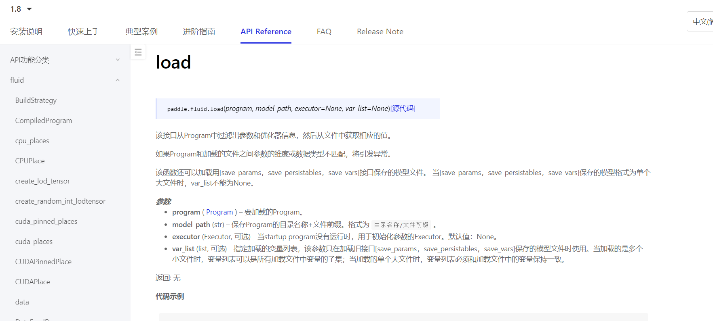
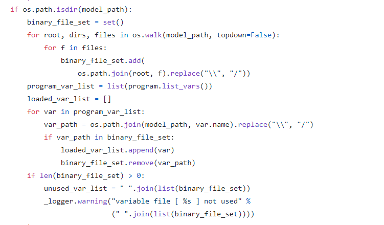

今年十月份学校成立了个人工智能学院，准备在明年开始招生；估计是学校想做下教学实验，最近我的Java老师组了个AI兴趣班，也因此我接触到了PaddlePaddle。

先放一句总结：用PaddlePaddle，就请做好读源码准备(特别是那些想要用动态图的人)。

## 第一印象

作为用过Tensorflow的苦手，PaddlePaddle上手十分容易。一是中文文档较之英文易读，二是有百度的`AI Studio`练手，这一过程还是比较"愉快"的；同时官方还给出了[TensorFlow-Fluid常用接口对应表](https://paddlepaddle.org.cn/documentation/docs/zh/api_guides/X2Paddle/TensorFlow-Fluid.html)，总之，对使用过Tensorflow的用户十分之友好。

## 深入使用

我用PaddlePaddle做的第一个项目是Image Captioning任务，代码基本照抄`Show Attend and Tell`的Tensorflow版实现，这里讲下我的体验：一是绝对不能想当然，用Tensorflow的经验去套PaddlePaddle，举个例子，`fc`层(即`Dense`)里有个`num_flatten_dims`，不查文档还真就出大问题了；二是官方的使用指南不太完善，想要用预训练模型却不知道怎么导入参数，最后是翻` fluid.io.save_persistables `的源码才找到`load_vars`这个操作，并模仿源码写了个` predicate `才把参数导入进去的。三是"Bug"，`softmax_with_cross_entropy`这个函数似乎在梯度传导时有些毛病，搜索了好一番才在github的issue里找到了解决方法(顺带一提，PaddlePaddle的社区比Tensorflow差远了)。

## 吐槽PaddlePaddle动态图

整个文档只有这么一个[页面](https://paddlepaddle.org.cn/documentation/docs/zh/user_guides/howto/dygraph/DyGraph.html)是介绍动态图的。估计官方的意思是："想要用动态图？自己看源码去"。不说了，你们自己看看文档体会一下吧。


## UPD：2020-05-21

------

今天研究了一下官方给的度量学习的例子，发现了一个没见过的函数`fluid.load()`，去Paddle文档一看，才发现Fluid已经更新到了1.8，这个函数是在1.7新增的。

先看一下文档的说明：



仔细研究后发现不对：在例子的`finetune.py`里直接`load`了预训练的模型checkpoint，但finetune的模型结构与与训练的不同！按理说这种情况下加载模型应该会报错（`load_persistables`或`load_param`会报错）

又仔细看了一遍文档，并没有相关的说明，只好看源码。



真相大白。

------

这也是为什么我之前说如果要用Paddle，就得做好读源码的准备----Paddle的文档写的真的差。


## UPD: 2020-05-22

cross_entropy的bug

```python
def loss(self, input, label):
    logit = fluid.layers.fc(input=input,
                            size=self.class_dim,
                            param_attr=fluid.ParamAttr(name="softmax_loss_fc_w"),
                            bias_attr=fluid.ParamAttr(name="softmax_loss_fc_b"))
    logit = fluid.layers.softmax(logit, use_cudnn=True)
    loss = fluid.layers.cross_entropy(input, label, soft_label=False)
    return loss, logit
```

~~不知为什么，以上代码得到的loss居然为为负值~~（个人猜测不是精度问题）

修复方式

```python
def loss(self, input, label):
    logit = fluid.layers.fc(input=input,
                            size=self.class_dim,
                            param_attr=fluid.ParamAttr(name="softmax_loss_fc_w"),
                            bias_attr=fluid.ParamAttr(name="softmax_loss_fc_b"))
    loss = fluid.layers.softmax_with_cross_entropy(logit, label)
    logit = fluid.layers.softmax(logit, use_cudnn=True)
    return loss, logit
```

