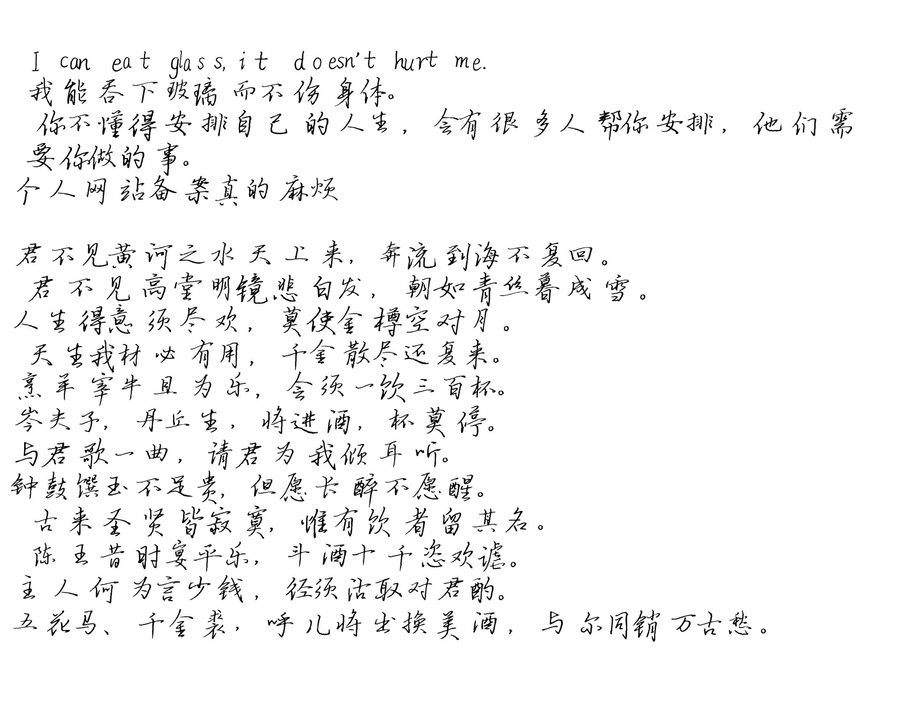

## 手写图片生成器

当被要求手写某某文档时可用。

会对生成的文字进行随机旋转、随机行/列间距、随机缩放等，以尽可能还原手写的状况。

目前英文生成的效果不是很好，参数还有待微调

接口

get: https://api.chgtaxihe.top/fake_handwriting?content=内容&rotate_l=-7&rotate_r=0

post:{content: 内容; rotate_l=-7; rotate_r=0}

$[rotate\_l,rotate\_r]$为文字旋转的角度范围

为了服务器着想，目前不允许超过25行或超过1500个字符

