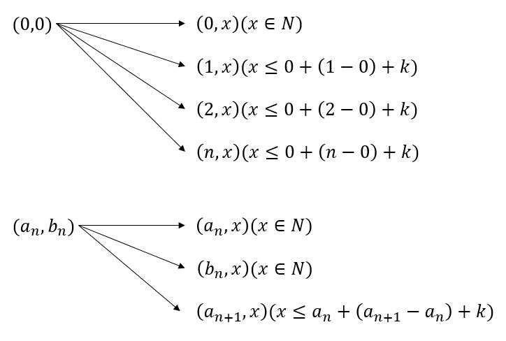

# 威佐夫博弈

有两堆各若干个物品$(x,y)$，两个人轮流从任一堆取至少一个或同时从两堆中取同样多的物品，不能不取，最后取完者得胜。


名词解析：

-   奇异局势：选手面对**奇异局势**时必输

威佐夫博弈的前几个奇异局势为$(0,0),(1,2),(3,5),(4,7),(6,10),\cdots$


## 性质

设$(x,y)$为第$k$个奇异局势

1.  $x$为前$1\cdots k$个奇异局势中没有出现过的最小正整数，$y=x+k$

2.  任意一个自然数都被包含在一个且仅在一个奇异局势中

    ​		由性质1可知每个自然数必定会出现

    ​		假设某个自然数$v$出现了不只一次，显然$v$不能作为$x$，而只能作为$y$

    ​		又因为不同奇异局势差依次递增，且$x$依次递增，因而$y$不同

3.  任何操作都会将奇异局势变为非奇异局势

    1.  若取走任意一堆的任意数量石子，根据性质2，局势转变为非奇异局势
    2.  若两对同时取走相同数量石子，由于一个差值只对应一种奇异局势，因而转变为非奇异局势


至于性质一的证明嘛....没有！


## 结论

设两堆石子为$(x,y)\quad(x<y)$

由上述性质，可知对于第$k$个奇异局势，$y_k-x_k=k$，且$\{x_i\},\{y_i\}$构成$Z^+$的一个分划

根据Betty定理，可以设$\{x_i\}=\{kA\mid k \in Z^+\},\{y_i\}=\{kA+k\mid k\in Z^+\}$

令$\frac{1}{A}+\frac{1}{A+1}=1$，得到$A$的一个无理数解$\frac{1+\sqrt{5}}{2}$

因此，第$k$个奇异局势为$\large(\lfloor k\frac{1+\sqrt{5}}{2}\rfloor,\lfloor k\frac{3+\sqrt{5}}{2}\rfloor)$


换句话说，先手必败(奇异局势)当且仅当$\lfloor(y-x)\frac{\sqrt{5}+1}{2}\rfloor=x$


### 例题 洛谷P2252

```python
import math
a, b = map(int, input().split())
x, y = [min(a, b), max(a, b)]
# 此处不能用'is'，必须用'=='
if (y - x) * (1 + math.sqrt(5)) // 2 == x:
    print(0) # 先手必败
else:
    print(1) # 先手必胜
```


# betty定理

对于两个**无理数**$p,q$，若$\large\frac{1}{p}+\frac{1}{q}=1$

那么对于$P=\{\lfloor np\rfloor,n\in Z^+\},Q=\{\lfloor nq\rfloor,n\in Z^+\}$，则$P,Q$构成正整数集的一个分划（即$P\cap Q=\emptyset,P\cup Q=Z^+$）


此处没有证明！！！


# 奇异局势$b_n=a_n+n$的来源

以下为感性分析


为了便于讨论，下文中的奇异局势$(a,b)$均满足$a\le b$

显然$(0,0)$是一个奇异局势，那么我们从$(0,0)$出发，把所有可以转移到$(0,0)$的状态划掉

那么 $\{(0,x),(x,x)\mid x \in N\}$会被划掉

接着，我们从未被划掉的点$(x,y)$中选取一个$x$最小的点（且为了满足$a\le b$，应在直线$y=x$上方寻找）

可知这个点为$(1, 2)$，该点为第一个奇异局势$(a_1=1,b_1=2)$，同时将可以转移到$(1,2)$的状态划掉

那么$\{(1,x),(2,x)\mid x\in N\}\cup\{(n,x)\mid n\in N,n>1,x\le 2+(n-1)\}$都已被划掉(?)，其中，$(a_2,2+(a_2-a_1))$在本轮被划掉

下一次取$a_2=3$，$b_2$只能取$2+(a_2-a_1)+1$

进而猜测

$$b_n-b_{n-1}=a_n-a_{n-1}+1$$

一番推导

$$\begin{array}{c}\because a_0 = b_0 = 0,\text{令} diff(n)=b_n-a_n\\\therefore diff(0)=0,diff(n)=diff(n-1)+1\\\therefore diff(n)=n\\\therefore b_n=a_n+1\end{array}$$


## 例题 HDU 6869 威佐夫博弈变形

两堆石头$(a,b)$，每次可以从一堆中取任意多个，或从两堆中分别取$(x,y)$个，且满足$\mid a-b\mid \le k$。其中$k$为题目所给的常数。最后取不到石头的者输。问先手是否有必胜策略。


仿照上述过程




最终得到通项

$$b_n=a_n+n(k+1)$$


# 参考

[wiki-贝亚蒂定理](https://zh.wikipedia.org/zh-hans/贝亚蒂定理)

https://blog.csdn.net/qq_30435963/article/details/108100061