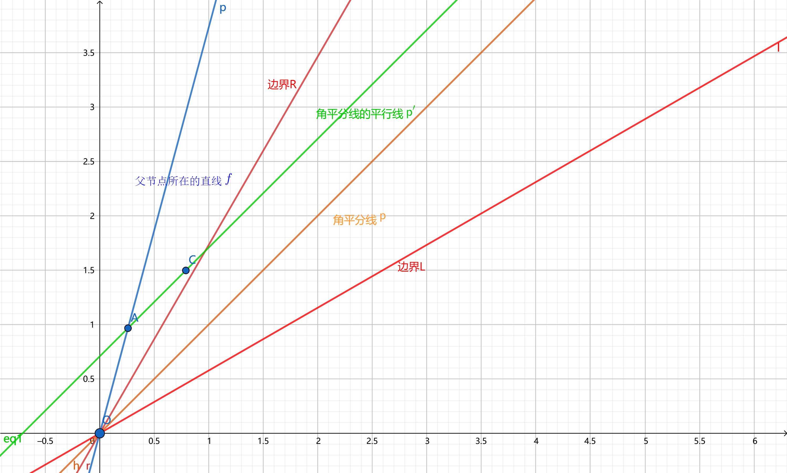

## Gym102483C  Circuit Board Design 

题意：给你一颗树，让你把树上的每个节点在二位平面上画出来，要求父节点与子节点之间边长度为1，且任意两条边不能相交、任意两个点之间的距离至少为$1e-4$、任意两条线段之间距离不小于$1e-6$。


## 神仙做法

可以保证不重叠

```cpp
double bias = 0;
void draw(int u, int fa){
    points[u] = point(points[fa].x + sqrt(1-bias*bias), points[fa].y + bias);
    bias += 0.001; // 太狠了
    for(int v:G[u]){
        if(v != fa) draw(v, u);
    }
}
draw(1, 0);
```


## 正常做法1--划分弧度

首先获取每个子节点的大小`sz`，然后根据子节点的大小把$[l,r]$划分给子节点，特别的，对于根节点有$l=0,r=2\pi$

核心代码如下:

```cpp
void draw(int u, int fa, double l, double r){
    double part = (r - l) / (sz[u] - 1);
    double x = points[u].x, y = points[u].y;
    for(int v:G[u]){
        if(v == fa) continue;
        double in = l, out = l + part * sz[v];
        double angle = (in + out) / 2;
        points[v] = point(x + cos(angle), y + sin(angle));
        draw(v, u, in, out);
        l = out;
    }
}
draw(1, 0, 0, 2 * pi);
```

这种做法不能说错（毕竟他也能AC），但是有点小问题。



如图所示，假设目前dfs遍历到节点$A$，设其所在的直线为$f$，并且它将$[L,R]$分配给子节点$v$。

考虑把子节点画在$[L,R]$的正中，即角平分线处。

为了做到平均分配，理想情况下子节点$v$应当在角平分线$p$上（设该理想点为$B$），但是上述代码的做法将使得子节点被画在$p'$上。（图中的$C$点）

所幸$\ang{fOC}<\ang{fOB}$，因而也能保证直线不重叠。

至于能否保证两条线段间的距离大于$1e-6$，鬼知道。


## 正常做法2--划分横坐标

训练时本能的排斥做法1，结果Wa到心态爆炸，后来想出了这种做法

由于角度不好计算，我们改为划分横坐标。

把$[l,r]$划分给子节点，特别的，根节点有$l=-1,r=1$。

核心代码

```cpp
const double eps = 1e-8;
void draw(int u, int fa, double from, double to){
    double partition = 0;
    if(sz[u] > 1) partition = (to - from) / (sz[u] - 1);
    int sum = 0;
    for(int v:G[u]){
        if(v == fa) continue;
        double nfrom = partition * sum + from;
        double nout = nfrom + partition * sz[v];
        sum += sz[v];
        double next_x = (nfrom + nout) / 2;
        double delta_x = fabs(points[u].x - next_x);
        double delta_y = sqrt(1 - delta_x * delta_x);
        points[v].x = next_x, points[v].y = points[u].y + delta_y;
        draw(v, u, nfrom, nout);
    }
}
draw(1, 0, -1, 1);
```


# 完整AC代码

神仙做法

```cpp
#include <bits/stdc++.h>
using namespace std;

vector<int> G[1010];
struct point{
    double x, y;
    point(){}
    point(double a, double b): x(a), y(b){}
}points[1010];

double bias = 0;

void draw(int u, int fa){
    points[u] = point(points[fa].x + sqrt(1-bias*bias), points[fa].y + bias);
    bias += 0.001; // 太狠了
    for(int v:G[u]){
        if(v != fa) draw(v, u);
    }
}

signed main(){
    int n;
    cin >> n;
    for(int i=1, u, v; i<n; i++){
        cin >> u >> v;
        G[u].push_back(v);
        G[v].push_back(u);
    }
    points[0] = point(0, 0);
    draw(1, 0);
    cout << fixed << setprecision(11);
    for(int i=1; i<=n; i++){
        cout << points[i].x << " " << points[i].y << '\n';
    }
}
```


