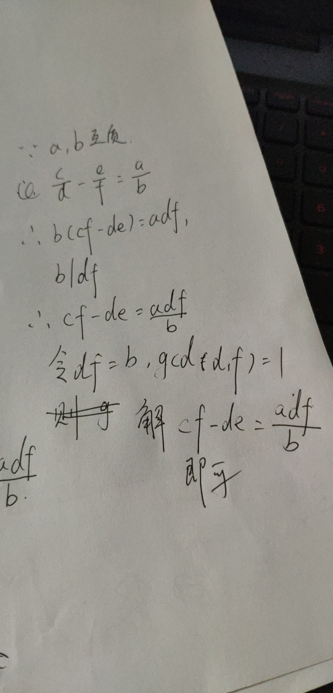

# 牛客训练赛3补题记录


## F: Fraction Construction Problem

队友提了一句a/b互质时不知道怎么解，瞬间让我有了思路...

贴一张赛时发给队友的图



剩下17分钟，疯狂码代码，结果一直Wa

赛后，队友用我的代码测了一下样例


检查后发现是因为多敲了个`return`，删掉就过了......


T_T


**Wa**代码

```cpp
#include <bits/stdc++.h>
#define ll long long
#define Android ios::sync_with_stdio(false), cin.tie(NULL)
using namespace std;

const int inf = 0x3f3f3f3f;
const int maxn = 2e6 + 1000;
bool not_prime[maxn];
int fact[maxn], prime[maxn], prime_cnt = 0;

ll exgcd(ll a, ll b, ll & x, ll & y){
    if(b == 0) return x=1, y=0, a;
    ll g = exgcd(b, a%b, y, x);
    y -= a/b*x;
    return g;
}

void solve(){
    ll a, b, g, c, e;
    cin >> a >> b;
    g = __gcd(a, b);
    if(g != 1){
        cout << 2 * a / g << " " << b / g << " " << a / g << " " << b / g << '\n';
        return;
    }
    if(!not_prime[b]){
        cout << "-1 -1 -1 -1\n";
        return;
    }
    ll d = 1, f = 1, p = 0;
    ll tmp = b;
    while(tmp > 1){
        if(p == 0 || p == fact[tmp]){
            p = fact[tmp];
            d *= p;
        }else{
            f *= fact[tmp];
        }
        tmp /= fact[tmp];
    }
    if(f == 1){
        d /= fact[b];
        f *= fact[b];
        return;
    }
    if(f >= b || d >= b){
        cout << "-1 -1 -1 -1\n";
        return;
    }
    if(f < d) swap(f, d);
    g = exgcd(f, d, c, e);
    if(a % g != 0){
        cout << "-1 -1 -1 -1\n";
        return;
    }
    if(c < 0){
        ll k = -c / d + 1;
        c += k * d, e -= k * f;
    }
    c *= a / g, e *= a / g;
    cout << c << " " << d << " " << -e << " " << f << '\n';
}
   
signed main(){
    fact[0] = fact[1] = 1;
    for(int i=2; i<maxn; i++){
        if(!not_prime[i]){
            fact[i] = i;
            prime[prime_cnt++] = i;
        }
        for(int j=0; j<prime_cnt && 1ll * i * prime[j] < maxn; j++){
            not_prime[i * prime[j]] = true;
            fact[i * prime[j]] = prime[j];
            if(i % prime[j] == 0) break;
        }
    }
    Android;
    int t; cin >> t;
    while(t--)
        solve();
}
```


## G: Operating on a Graph

直接用**unordered_set**存边，结果TLE了，题解说用链表存边。这样一来合并时可以$O(1)$合并！

 **这题用vector+sort+unique比用unordered_set快**

```cpp
#define TARGET_OJ Codeforces
#define AGRESSIVE_OPT 1
#ifdef ONLINE_JUDGE
    #if (TARGET_OJ == Codeforces || TARGET_OJ == HDU)
        #pragma GCC optimize("unroll-loops")
        #pragma GCC target("sse,sse2,sse3,ssse3,sse4,popcnt,abm,mmx,avx")
    #endif
    #if (AGRESSIVE_OPT == 1)
        #pragma GCC optimize("Ofast")
    #endif
#endif
#pragma GCC optimize(2)

#include <bits/stdc++.h>
#define ll long long
#define ull unsigned long long
#define int128 __int128_t
#define Android ios::sync_with_stdio(false), cin.tie(NULL)
#define redirect_input freopen("./input.txt", "r", stdin);
#define redirect_output freopen("./input.txt", "w", stdout);
#define debug(s, r) std::cerr << #s << ": " << (s) << (r==0?' ':'\n')
#define pii pair<int, int>
#define sqr(x) ((x)*(x))
using namespace std;
 
const ll inf = 0x3f3f3f3f3f3f3f3f;
const int maxn = 8e5 + 1000;
 
int head[maxn], tail[maxn], nxt[maxn * 2], dest[maxn * 2], edge_cnt;
int dsu[maxn], n, m, q;

int lookup(int x){
    if(x == -1) return -1;
    return dsu[x]==x?x:dsu[x]=lookup(dsu[x]);
}

void add_edge(int u, int v){
    dest[edge_cnt] = v, nxt[edge_cnt] = head[u];
    head[u] = edge_cnt++;
    if(tail[u] == -1) tail[u] = head[u];
}

void solve(){
    cin >> n >> m;
    edge_cnt = 0;
    for(int i=0; i<=n; i++) head[i] = tail[i] = -1, dsu[i] = i;
 
    for(int i=0, u, v; i<m; i++){
        cin >> u >> v;
        add_edge(u, v);
        add_edge(v, u);
    }

    cin >> q;
    for(int i=0, x; i<q; i++){
        cin >> x;
        if(lookup(x) != x) continue;
        vector<int> part;
        for(int e=head[x]; ~e; e=nxt[e]){
            int v = lookup(dest[e]);
            if(v != x && v != -1) part.push_back(v), dsu[v] = x;
        }
        sort(part.begin(), part.end());
        part.erase(unique(part.begin(), part.end()), part.end());
        head[x] = -1;
        if(part.size() >= 1){
            head[x] = head[part[0]];
            tail[x] = tail[part[0]];
            for(int i=1; i<part.size(); i++){
                nxt[tail[x]] = head[part[i]];
                tail[x] = tail[part[i]];
            }
        }
    }
    for(int i=0; i<n; i++){
        cout << lookup(i) << (i==n-1?'\n':' ');
    }
}

signed main(){
    Android;
    int t; cin >> t;
    while(t--)
        solve();
}
```


## D: Points Construction Problem

考虑一开始时任意两个黑点互不相邻，那么此时对数$p=4*n$。

当两个点相邻形成的一条边，将使得$p$减少$2$，因此，缺少的边数$r=(4*n-m)/2$

若$r<n$，那么用直链构造出即可。

若$r\ge n$，则需要考虑构造矩阵。


## H: Sort the Strings Revision

