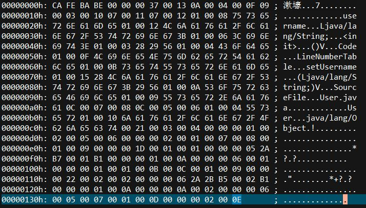
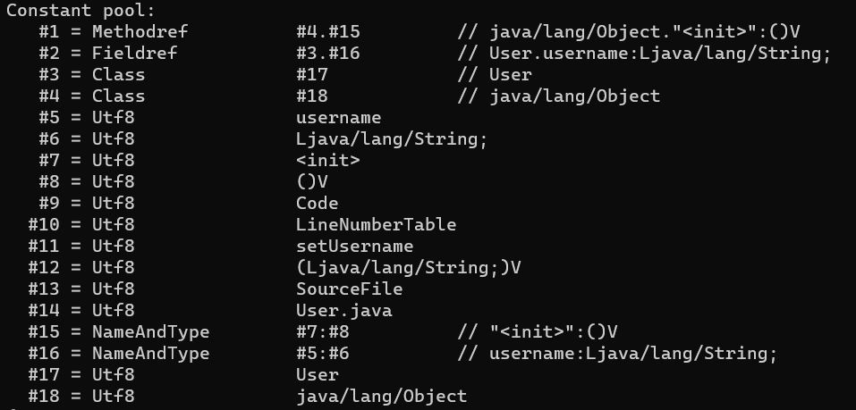

## 第二章：Java内存区域与内存溢出异常

### 运行时内存区域（Run-Time Data Areas）

1.  程序计数器PC register (jvms: 2.5.1)：

    **每个**JVM线程均持有一个PC，类似于CPU中的PC寄存器，但需要注意的是，尽管JVMS中将其称为"pc register"，且CPU中通常也有多个PC[^2-1]，但两者并不是一回事，JVM的PC存放在内存中。

2.  JVM栈Java Virtual Machine Stacks (jvms: 2.5.2)

    **每个**JVM线程都有自己**私有**的JVM栈。类似于C++等语言，每个方法被执行时，就会同步创建一个**栈帧**(Stack Frame)，用于保存局部变量表、操作数栈、动态连接、方法出口等

    每个方法的局部变量表所占用的空间（槽数，Slot）在编译时确定，在运行时不会改变

    此区域可能抛出的异常

    -   StackOverflowError: 栈深超过允许范围
    -   OutOfMemoryError: 若栈允许动态拓展，且无法在拓展时抛出（HotSpot不允许动态拓展栈容量）

3.  Native Method Stacks (jvms: 2.5.6)

    类似于JVM stacks

4.  Java堆Heap (jvms: 2.5.3)

    Java堆由所有JVM线程**共享**，在不考虑JVM优化的情况下，所有对象实例以及数组均在堆上分配

    Java堆既可以固定大小，也可以动态拓展（或缩小）

    此区域可能抛出的异常

    -   OutOfMemoryError: 当新的对象无法分配到足够的内存时，抛出此异常

5.  方法区Method Areas (jvms: 2.5.4)

    由JVM所有线程**共享**，逻辑上是Java堆的一部分；在JDK6及以前的HostSpot中，该区域保存在Java堆的永久代中，JDK8废弃永久代后，该区域保存于在本地内存的元空间(Meta-space)中。该区域保存JVM加载的类型信息、常量、静态变量、JIT编译后的代码缓存等，此区域允许不实现垃圾回收

    此区域可能抛出的异常

    -   OutOfMemoryError: 无法分配到足够的内存时，抛出此异常

6.  运行时常量池Run-Time Constant Pool (jvms: 2.5.5)

    方法区的一部分，用于保存Class文件的常量池表，存放编译器生成的各种字面量与符号引用；同时，运行时也可以将新产生的常量放入其中

7.  直接内存

    并非JVMS中规定的内存区域

    例如在NIO中，使用了Native函数直接分配**堆外**内存，以此提高性能，避免在Java堆和Native堆中来回复制数据

    此区域不受Java堆大小上限控制


### HostSpot虚拟机中的对象

#### 创建对象

当创建一个普通的Java对象时，首先JVM会检查能否在常量池中定位到这个类的符号引用，并检查引用代表的类是否被加载（若没有，则执行加载操作）

随后，JVM将为对象分配内存（所需内存大小在加载时即可确认）；寻找可用内存时，可以有两种方法：

1.  “Bump the Pointer”，即如同栈一样，将空闲指针后移一段距离
2.  维护一个空闲列表，在列表中查找可用空间

在并发情况下，即使是修改指针位置也不是线程安全的，为了减少加锁次数，有两种解决方案

1.  CAS(Compare and Swap)并重试：

    采用CPU的CAS指令[^2-2]来实现原子操作（若失败则继续重试直至成功）

2.  TLAB(Thread Local Allocation Buffer)：

    每个线程在Java堆中先分配一小块内存，线程分配内存时，在本地缓冲区中分配，仅当缓冲区空间用尽，分配新的缓冲区时才需要加锁

分配完成后，需要对分配空间初始化为0值

随后，还需要设置对象的`对象头`，其中包含：

1.  GC分带年龄、锁状态、线程持有的锁等
2.  如果通过直接指针访问对象，则需要保存类型指针
3.  如果是数组，则还需保存数组长度

接下来，如果有需要的话，将执行对象的构造函数


#### 引用对象

对象的访问方式由JVM实现而定，通常有2种方式

1.  引用中保存对象的句柄地址：Java堆中可能会划分出一块作为句柄池，其中保存对象到实例数据、类型数据的指针。当移动对象时，只需改变实例数据指针，无需改变引用
2.  引用中保存直接指针：引用直接持有对象地址，访问速度更快，但移动对象时需要修改栈中的引用


[^2-1]:多核CPU中每个核均有独立的一套寄存器、内存管理、TLB、L1L2缓存。

[^2-2]:如汇编指令cmpxchg


## 第三章：垃圾收集器与内存分配策略

### 对象死亡判定

#### 引用计数算法

简单高效但不完整的算法

当被引用时，引用计数器加一；引用消失时，引用计数器减一；引用计数器归零的对象就是不可能再被使用的

当对象之间发生相互循环引用问题时，简单地引用计数无法将其回收，需要使用额外的算法


#### 可达性分析

从“GC Root”根节点出发，以引用关系为边（成为引用链），能到达的节点即为存活。

在Java中，固定可作为GC Root的对象有：

-   虚拟机栈中引用的对象（局部变量等）
-   本地方法栈中引用的对象
-   方法区中类静态(static)属性引用
-   方法区中的常量引用对象（如字符常量池中的引用）
-   JVM内部的引用，如基本数据类型的Class对象，常驻的异常、系统类加载器等
-   被同步锁持有的对象
-   反应JVM内部情况的JMXBean、本地代码缓存等

此外，JVM还可以临时性的将其他对象加入GC Root


#### 引用类型

Java 1.2以后，引用被分为了4类

-   强引用(Strongly Reference)：类似于`Object obj = new Object()`的引用关系，在任何情况下，只要强引用存在，GC就不会回收被引用的对象
-   软引用(Soft Reference)：只被软引用关联的对象，在将要发生**内存溢出异常**前（内存不足时），会把这些对象列入回收范围中进行**第二次回收**，若内存仍然不够，抛出内存溢出异常
-   弱引用(Weak Referencee)：只被弱引用关联的对象，只能生存到下一次垃圾收集前。当垃圾收集器发现一个只具有弱引用的对象时，无论内存是否充足都会回收该对象
-   虚引用(PhantomReference)：一个对象是否有虚引用不影响其生存周期，也**无法通过虚引用获取对象实例**，唯一作用在于该对象被垃圾收集器回收时会收到一个**通知**（所以只能配合弱引用、软引用使用？）


#### 回收方法区

主要包含：废弃的常量、不再使用的类型

判断常量是否废弃类似于堆中的对象

判断类型是否废弃则比较苛刻，需要满足以下条件

-   该类的所有实例都已经被回收
-   该类对应的Class对象没有在任何地方被引用
-   加载该类的类加载器已被回收（很难达成）


### 垃圾回收算法

#### 分代收集

基于两个假说

-   弱分代假说：绝大多数对象都是很快死亡的
-   强分代假说：熬过越多次垃圾收集过程的对象就越难以死亡

这两个假说导出一个结论：收集器应当将堆划分为不同区域，并依据对象的年龄将其分配到不同区域中储存

然而，当需要针对某一代进行垃圾收集时，可能存在跨代引用的情况：如对新生代进行垃圾收集时，可能存在老年代对新生代的引用，为此不得不将整个老年代加入到GC Root中（额外遍历了整个老年代）以保证结果的正确性

为了解决上述问题，这里需要引入第三个假说

-   跨代引用相对于同代引用来说只占极少数

根据上述假说，我们不再需要为了少数的跨代引用而遍历整个老年代，只需建立一个数据结构（成为Remembered Set），将老年代划分为若干个小块，并表示出那一块会存在跨代引用；当对新生代进行收集时，只需将存在跨代引用的块内对象加入GC Root即可


#### 标记-清除算法

首先标记处所有需要回收的对象，标记完成后，统一回收掉所有被标记的对象

存在2个缺点

-   执行效率不稳定（随堆大小增长而线性增长）
-   内存空间碎片化


#### 标记-复制算法

将可用内存划分为大小相等的两块，每次只使用其中一块。当发生垃圾收集时，将存活对象复制到另一个块中，并将当前块清空。

大多数JVM都采用了这种算法去回收新生代，称为“Appel式回收”，具体做法是：

将新生代划分为一块较大的`Eden`空间和两块较小的`Survivor`空间，每次分配内存时只使用`Eden`和一块`Survivor`，当发生GC时，将其中存活的对象复制到另一块`Survivor`中，并直接清理`Eden`和旧的`Survivor`（HotSpot中`Eden`和`Survivor`的大小比例是8:1）

当`Survivor`不足以容纳存活的对象时，需要依赖其他区域来进行分配：多出来的对象直接进入老年代


#### 标记-整理算法

当对象存活率较高时，标记-复制算法效率不高，且标记复制算法需要额外空间进行担保，所以老年代不能选择该算法

标记-整理算法具体操作为：标记存活对象，随后让存活对象都向内存空间一段移动，最后清理边界外内存

进行整理操作的缺点在于，必须暂停用户程序才能进行；然而若是采用标记-清除算法，空间碎片化的问题只能依靠复杂的内存分配器来解决（如维护空闲列表）


### HotSpot的算法细节

#### 准确式内存管理

VM可以知道内存中（栈和堆包括在其中）某个位置的数据具体是什么类型，比如对于一个4字节的整数，虚拟机可以区分出它到底是一个int还是一个内存地址

此外，还有保守式和半保守式（根上保守）

推荐阅读：https://www.cnblogs.com/strinkbug/p/6376525.html


#### 从根节点枚举

由于HotSpot采用准确式内存管理，使用一组`OopMap`来保存对象某个偏移量上是什么类型的数据，即可以知道哪些位置保存的是引用，因而不必像保守式GC一样扫描所有数字[^3-1]

[^3-1]: 此处存疑

#### 安全点、安全区域 *

这部分未能理解，日后补上


#### 记忆集、卡表与写屏障

上文提到，分代收集时需要借助记忆集(Remembered Set)来记录跨代引用

HotSpot中将内存划分为一个个特定大小的块，称为卡页；同时使用一个字节数组来表示内存区域中的卡内是否存在跨代指针，称为卡表


当卡页内有一个或多个对象内存在跨代指针，那么卡表内对应元素的值标识为1，成为这个元素变脏(dirty)。

```
CARD_TABLE [this address >> 9] = 1;
```

在GC时，只需从变脏的卡页中得到跨代指针，加入GC Roots中即可


每当引用发生改变，就可能产生新的脏卡页，因此在每个赋值语句后，都应当插入更新卡表的操作，HotSpot中采用写屏障（类似与AOP）来解决该问题：虚拟机会自动为所有赋值操作生成对应的更新卡表指令[^3-2]

[^3-2]: 在多线程环境下，卡表还存在“伪共享”问题


##### 小问题 *

读到这里我有一个疑惑：书中并没有介绍卡页变脏后是否存在机会变“干净”，若只使用上文中提到的数组，那么当脏卡页内**不再**存在跨代指针时，没有足够的信息（除非再扫描一遍）将其变“干净”。

虚拟机中是否有某些机制能够避免在扫描一遍的浪费（比如计数）？


#### 并发的可达性分析

我们将可达性分析过程中的对象分为三类

1.  未被访问
2.  已被访问
3.  正在被访问（对象内至少有一个引用还未被扫描）

若是在可达性分析的过程中，对象的引用关系发生了变化，则有可能导致以下结果

-   本应死亡的对象被标记为存活（不破坏程序正常运行，不予处理）
-   本应存活的对象被标记为死亡（对象消失）

当且仅当以下条件同时满足时，会产生对象消失问题：

1.  插入了一条或多条从已被访问对象到未被访问对象的引用

    为了破坏此条件，当插入从已访问指向未访问对象的引用时，将其记录下来，扫描结束后从这些已访问对象开始再扫描一遍。可理解为，当新的引用插入时，已访问对象将变为为访问对象（或未被完全扫描的对象）

2.  删除了全部从正在被访问到该未被访问对象的引用

    为破坏此条件，删除从正在访问对象到未被访问对象的引用时，将其记录下来，扫描结束后在根据这些记录扫描一遍。可理解为：无论删除与否，只根据开始扫描那一刻的引用关系来搜索。

注意：重新扫描的过程可能需要"Stop the World"（如CMS中重新标记过程）


### 各类垃圾收集器简介 *

一阅未能理解，不整理笔记，日后补充


## 第七章：虚拟机类加载机制

一个类在使用前需要经历：

1.  加载（Loading）

2.  链接（Linking）

    链接被分为3部分

    1.  验证（Verification）

    2.  准备（Preparation）

    3.  解析（Resolution）：

        解析比较特殊，允许发生在初始化之后

3.  初始化（Initialization）


### 类初始化的时机

JVMS规定只有以下六种情况才会初始化一个类

-   触发`new`/`getstatic`/`putstatic`/`invokestatic`四条字节码时
-   使用反射调用对应类时
-   自身作为父类，且子类需要初始化时
-   虚拟机启动时，需要执行的主类（main入口函数那个类）
-   当接口中定义了默认方法（default），该接口的实现类进行初始化时，该接口需要先进行初始化
-   The first invocation of a java.lang.invoke.MethodHandle instance which
    was the result of method handle resolution for a method handle
    of kind 2 (REF_getStatic), 4 (REF_putStatic), 6 (REF_invokeStatic), or 8
    (REF_newInvokeSpecial).

需要注意的是：

1.  通过子类引用父类的静态字段，只会初始化父类（即只初始化定义对应字段的类）

2.  通过数组定义来引用类，不会触发此类的初始化 *

3.  常量（static final）进入常量池，因而不会触发定义常量的类初始化

4.  当类继承了接口且接口没有`default`方法时，不会初始化该接口

    ```java
    public interface IClass {
    
        static int val = run();
    
        static int run(){
            System.out.println("init");
            return 0;
        }
    
        // default void initMe(){}
    }
    
    public class Klass implements IClass{}
    
    public class InitOfInterface {
    
        public static void main(String[] args) {
            Klass klass = new Klass();
            System.out.println("new Klass");
            System.out.println("klass.val: " + klass.val);
        }
    
    }
    /* 注释第10行后输出:
    new Klass
    init
    klass.val: 0
    */
    ```

    

### 类加载过程 *

因为一些特殊的原因（计划被打乱了），此节暂时跳过


### 类加载器 *

类加载器负责实现类的加载，每个Java类在VM中的唯一性由**其类加载器与这个类本身**共同确定

JDK 8及更低版本中有着三层类加载器、双亲委派的类加载结构

1.  Bootstrap Class Loader：
2.  Extension Class Loader：
3.  Application Class Loader：

双亲委派模型：

​	如果一个类收到了类加载请求，会首先将请求委派给父类加载器，若父类加载器无法完成加载，才会尝试自己完成。这就保证了在各类加载器环境下，加载出的类（比如Object等）都是同一个。


#### 实现一个简单类加载器 *


#### Spring 与 ClassLoader *


### 模块化Java *


## 第六章：类文件结构

>   Java技术在发展之初，设计者们就曾经考虑过并实现了让其他语言运行在Java虚拟机之上的可能

JVM只与Class文件绑定，也就是说任何一门语言只要能表示为能被JVM接受的Class文件，均可以运行在JVM之上


### Class文件结构

下面以JDK 11为例，使用`javac`编译下面的代码

```java
public class User {

    private String username;

    public void setUsername(String username){
        this.username = username;
    }

}
```

使用十六进制编辑器打开生成的Class文件



----

Class文件以8个字节为基础单位，按照高位在前（Big-Endian），由`无符号数`和`表`组成，其中`表`由多个`无符号数`或其他`表`组成，Class整个文件也可以视作一张表

下面以`u1`/`u2`/`u4`/`u8`分别代表1/2/4/8个字节的无符号数


#### class文件头

class文件头固定以一个u4魔数`0xCAFEBABE`开头，便于其他程序识别这是一个Class文件

随后是一个u4的Class文件版本号，低位u2是次版本号（从Java 1.2起均为0），高位u2是主版本号（JDK 6对应50，每升一个大版本则加1）


#### 常量池

在版本号后是常量池入口，开头为u2的容量计数器（值从1而非0开始，例如上图中计数器值为0x13，代表有0x12个常量）

使用`javap -verbose User`可以看到其中的常量池



#### 访问标志

常量池结束后，紧跟着一个u2的访问标志，用来表明这个Class是类还是接口/枚举/注解、是否定义为public、是否定义为abstract/final等


#### 类索引、父类索引和接口索引集合

| 大小   | 内容                                                         |
| ------ | ------------------------------------------------------------ |
| u2     | 类索引，指向常量池中CONSTANT_Class_info的常量                |
| u2     | 父类索引（除Object类外均不可为0），指向常量池中CONSTANT_Class_info的常量 |
| u2     | 接口计数器                                                   |
| u2 * n | 接口索引                                                     |


#### 字段表集合

用于描述接口或者类中声明的变量（不包含方法内部的局部变量）

首先是一个u2作为容量计数器n，随后跟上n个字段

每个字段表结构如下

| 大小   | 内容                                                         |
| ------ | ------------------------------------------------------------ |
| u2     | access_flags                                                 |
| u2     | name_index：指向一个Utf8类型的常量                           |
| u2     | descriptor_id：指向一个Utf8类型的常量（用来声明类型，如int则为"I"） |
| u2     | 属性表计数                                                   |
| 不固定 | 属性表                                                       |


#### 方法表 *

因为一些特殊的原因（计划被打乱了），此节暂时跳过


#### 属性表 *

因为一些特殊的原因（计划被打乱了），此节暂时跳过

##### Code属性 *


## 后记

因为一些**特殊原因**，去学C++了，这篇笔记先暂时放下，~~或许某天会补完？~~